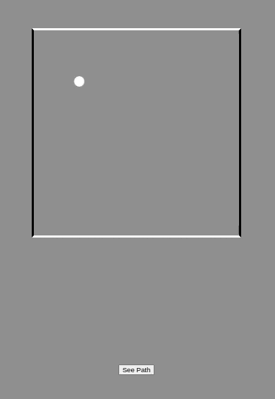

# BouncingBall

---

## Purpose

> Moving the element in a random direction is the basic concept behind programmatic mathematics. Where the different rules and conditions are. This is a simple web Application that's show you how things are work in real life projects.

---

## How it's works

### Here is the references material

We use the angle for moving ball and calculate **Cos/Sin** again and again. If you want to go in advance them you can calculate with use unit velocity direction vector with components. And when ball get hit the wall we change the angle by use of 180/360.

- [**Here is better Explanation**](https://stackoverflow.com/questions/45154176/calculate-angle-change-after-hitting-a-tilted-wall)

> Here is the all material if you want to understand how is works. You need these videos for better understanding.

- [**First video**](https://youtu.be/vuoNyvMvDtA)
- [**Secound video**](https://youtu.be/LO3Awjn_gyU)
- [**Third video**](https://youtu.be/r2S7j54I68c)

### How to use

1. Click on green **Clone or download** button and choose Download ZIP.
2. Find the downloaded zipped file on your pc and extract it.
3. Go to folder. Inside the folder you will find a file named **index.html**.
4. Double click on **index.html** file and your browser wlicenseill open (or maybe just a new tab) and you will see the reuslt.
5. If for whatever reason your browser does not open, right click on **index.html** file go down to **Open with**
   and choose your web browser. This will open the browser and launch it.

Once you are done playing you can close the tab in your browser.

---

### BouncingBall

> If you have any issues with the game feel free to let me know!

> If you are more interested, check out the collection of others [ **DSDmark Repos**](https://github.com/DSDmark?tab=repositories "DSDmark Repos").

---
